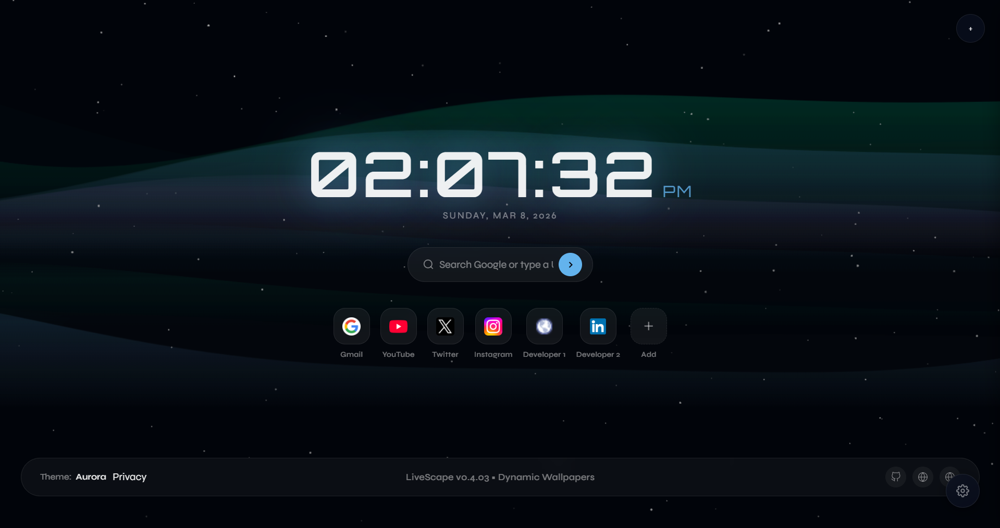
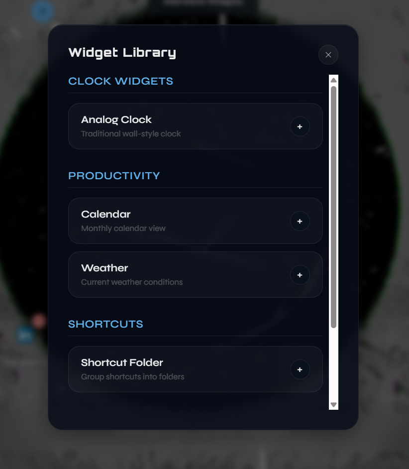
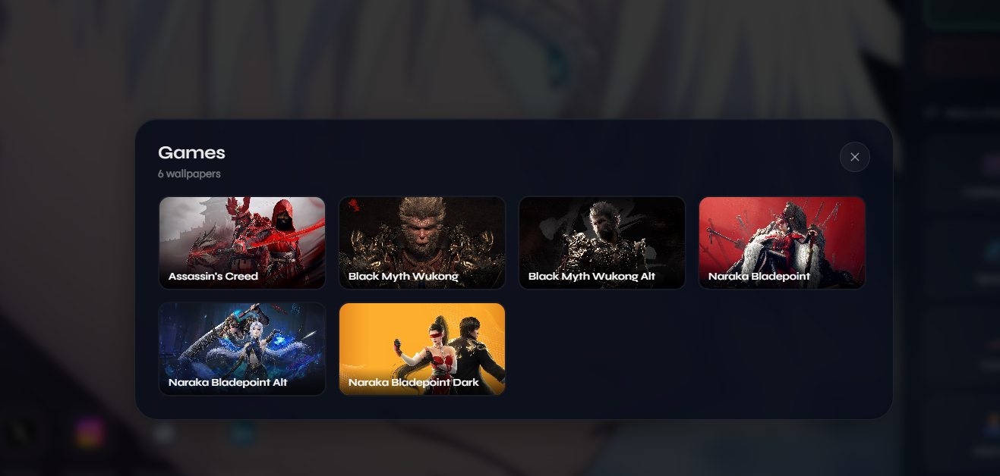

<div align="center">


# 🌿 LiveScape

**Transform your browser's new tab into a dynamic, interactive dashboard.**

[](LICENSE)
[](manifest.json)
[](#-installation)
[](docs/LiveScape_Final_Security_Audit.docx)
[](#-contributing)
[](#)

</div>

---

## 📖 What is LiveScape?

**LiveScape** is a customizable browser New Tab extension that transforms your default browser start page into a **dynamic, interactive dashboard**.

It combines **live wallpapers**, **movable widgets**, **customizable shortcuts**, and a **modern glassmorphism interface** to create a visually rich and productivity-focused browsing experience. Users can personalize their dashboard with animated wallpapers, drag-and-drop widgets, shortcut folders, and useful tools like weather forecasts, calendars, clocks, and music players.

LiveScape is designed to be **lightweight, flexible, and fully customizable** while maintaining smooth performance.

---

## ✨ Features

### 🎬 Live Wallpapers
- Support for **Video**, **GIF**, and **Canvas-based** animated wallpapers
- Wallpaper **categories** for organized browsing
- **Auto-rotation** to cycle through wallpapers automatically

### 🧩 Widget System
- **Movable and resizable** widgets — drag them anywhere on the screen
- **Widget Library** to add, remove, and manage widgets on demand
- Widget positions persist across sessions via local storage

### 🕐 Analog Clock Widget
- Classic analog clock rendered directly on the dashboard

### 📅 Calendar Widget
- Interactive calendar widget displayed on the new tab page

### 🌤️ Weather Widget
- Live weather information displayed as a draggable dashboard widget

### 🎵 Music Player Widget
- Built-in music player widget supporting Spotify and Apple Music embeds

### 🔗 Shortcut Management
- Add, edit, and remove **custom website shortcuts**
- **Shortcut Folder System** to group and organize your links
- Full **drag-and-drop** reordering of shortcuts and folders

### 📐 Snap-to-Grid Layout
- **Snap-to-grid** system for precise widget and shortcut alignment
- **Layout reset** and **export / import** options

### 🎨 Glassmorphism UI
- Modern **glassmorphism design language** throughout the interface
- Frosted glass panels, soft shadows, and translucent overlays

### 💾 Local Storage
- All preferences, layouts, and settings stored **locally in your browser**
- No account required — completely offline-capable

---

## 📸 Screenshots

> _Have a great screenshot? Open a PR and add it here!_

| Dashboard | Widgets | Wallpaper Selection |
|:-:|:-:|:-:|
|  |  |  |

## 🎥 Live Preview

<div align="center">
   <video src="Preview-Images/Preview-of-live-video.mp4" controls width="100%"></video>
</div>

> _Can't see the video? [Click here to watch it directly](Preview-Images/Preview-of-live-video.mp4)_

---

## 🚀 Installation

LiveScape is not yet on the Chrome Web Store. Install it manually in a few steps:

**1. Clone or download the repository:**

```bash
git clone https://github.com/chanukyachintada06/LiveScape.git
```

Or click **Code → Download ZIP** and extract it.

**2. Open Chrome and navigate to:**

```
chrome://extensions
```

**3. Enable Developer Mode** using the toggle in the top-right corner.

**4. Click "Load Unpacked"** and select the extracted `LiveScape` folder.

**5. Open a new tab** — LiveScape is now live! 🎉

> **Firefox users:** The extension includes a Gecko ID in `manifest.json` and is compatible with Firefox. Load it via `about:debugging` → "Load Temporary Add-on".

---

## 📁 Project Structure

```
LiveScape/
│
├── animations/              # Canvas & CSS animation engines for live wallpapers
│
├── assets/
│   └── icons/               # Extension icons (16px, 48px, 128px)
│
├── wallpapers/              # Bundled wallpaper assets (video, GIF, static images)
│
├── docs/
│   └── LiveScape_Final_Security_Audit.docx   # Full independent security audit report
│
├── newtab.html              # New tab page — the main UI entry point
├── script.js                # Core JS — widgets, drag/drop, shortcuts, storage logic
├── style.css                # Global styles — glassmorphism, layout, theming
├── manifest.json            # Chrome Extension manifest — permissions, version, config
│
├── privacy.html             # In-extension privacy policy page
├── PRIVACY.md               # Privacy policy (Markdown format)
├── LICENSE                  # MIT License
│
└── README.md                # Project documentation
```

---

## 🔒 Security

LiveScape has undergone a full independent static security audit. All critical and high-severity vulnerabilities have been resolved prior to the v0.4.03 release.

### Audit Summary

| Severity | Found | Resolved | Deferred |
|----------|-------|----------|----------|
| 🔴 HIGH | 3 | **3 / 3** | 0 |
| 🟡 MEDIUM | 6 | **4 / 6** | 2 |
| 🟢 LOW | 6 | **2 / 6** | 4 |

**Fixes applied in v0.4.03:**
- `javascript:` / `data:` URL scheme injection blocked in all shortcut inputs
- `innerHTML` replaced with `textContent` for all user-controlled data
- Music player iframes now include a full `sandbox` attribute
- `web_accessible_resources` restricted to `chrome-extension://` only
- CSP hardened with `connect-src` and `frame-src` directives
- `ResizeObserver` instances properly disconnected on widget removal
- `rel="noopener noreferrer"` added to all external links
- Layout import now validates and sanitizes all imported URLs and numeric values

📄 **Full report:** [`Security Audit`](docs/LiveScape_Security_Audit.docx)

---

## 🛣️ Roadmap

| Status | Version | Feature |
|--------|---------|---------|
| 🔜 Next Up | v0.4.x | Settings Panel |
| 🔜 Next Up | v0.4.x | Widget Visibility Controls |
| 📋 Planned | Future | Weather widget IP geolocation consent UI |
| 📋 Planned | Future | GIF storage migration to IndexedDB |
| 📋 Planned | Future | Theme Presets |
| 📋 Planned | Future | Chrome Web Store Release |
| 📋 Planned | Future | Performance Optimizations |

---

## 🤝 Contributing

LiveScape is fully open source and **all contributions are welcome** — bug fixes, new features, new wallpapers, documentation improvements, or design enhancements.

### How to Contribute

1. **Fork** this repository
2. **Create a branch:**
   ```bash
   git checkout -b feature/your-feature-name
   ```
3. **Commit your changes:**
   ```bash
   git commit -m "feat: describe what you added or fixed"
   ```
4. **Push to your fork:**
   ```bash
   git push origin feature/your-feature-name
   ```
5. **Open a Pull Request** — describe your changes and it'll be reviewed promptly.

### Ideas for Contributions
- 🔧 Fix a bug or implement a roadmap feature
- 🖼️ Submit new wallpaper or animation presets
- 🧩 Build a new widget type
- 🌐 Help port LiveScape to Firefox
- 📝 Improve documentation or add screenshots

---

## 🔒 Privacy Policy

LiveScape is built with privacy as a core principle:

- ✅ All user data stored **locally** — never transmitted to any server
- ✅ **No analytics, no telemetry, no tracking** of any kind
- ✅ All assets are **bundled locally** — no external network requests at runtime
- ✅ Only the minimum permissions declared in `manifest.json` are requested
- ✅ Weather widget uses browser geolocation API which prompts for user permission

Full policy: [`PRIVACY.md`](PRIVACY.md)

---

## 📦 Current Version

```
LiveScape v1.0.0
```

---

## 📄 License

This project is open source under the **[MIT License](LICENSE)**.

You are free to **use, copy, modify, merge, publish, distribute, sublicense, and/or sell** copies of this software. See [`LICENSE`](LICENSE) for full terms.

---

<div align="center">

Made with ❤️ by [chanukyachintada06](https://github.com/chanukyachintada06) & [Sreecharan Lavudiya](https://www.linkedin.com/in/sreecharan-lavudiya/)

⭐ **Star this repo if you find LiveScape useful — it means a lot!**

[Report a Bug](https://github.com/chanukyachintada06/LiveScape/issues) · [Request a Feature](https://github.com/chanukyachintada06/LiveScape/issues) · [Submit a PR](https://github.com/chanukyachintada06/LiveScape/pulls)

</div>
